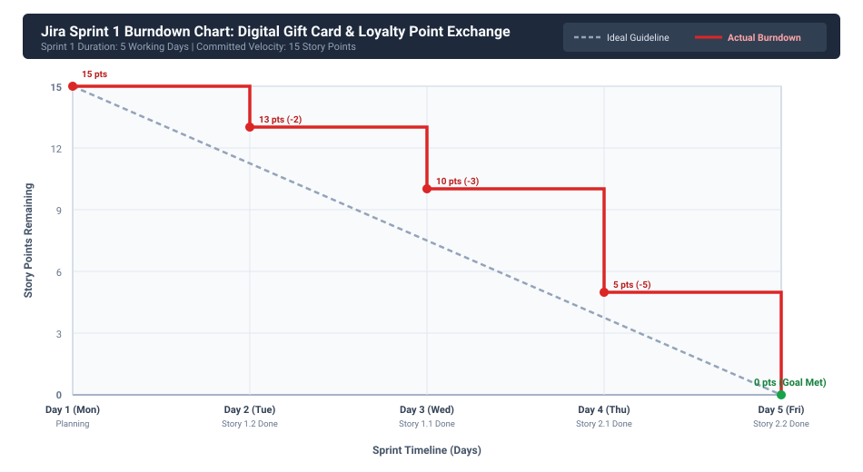

# Lab 2: Agile Backlog Creation & Sprint Simulation in Jira
## PES University — Department of Computer Science & Engineering
### Course: Software Engineering / Systems Modelling Lab
**Problem Statement #34:** Digital Gift Card & Loyalty Point Exchange Platform

---

## 🎯 1. Lab Objectives & Scope
Following the requirements elicitation from Lab 1, this lab translates functional requirements into an **Agile Product Backlog** in Jira, structures work into **Epics** and **User Stories**, assigns **Story Points using the Fibonacci sequence** via Planning Poker estimation, simulates **2 Sprints**, and evaluates team performance using a **Sprint Burndown Chart**.

---

## 🏗️ 2. Agile Backlog: Epics & User Stories

### **Epic 1: Multi-Merchant Loyalty Point Aggregation** (`EPIC-1`)
*Description:* Enable Account Holders to securely link multiple external merchant loyalty accounts and view aggregated point balances in a unified digital wallet view.

| Story ID | User Story Title | User Story Description (`As a... I want... So that...`) | Priority | Story Points (Fibonacci) | Acceptance Criteria |
| :--- | :--- | :--- | :--- | :---: | :--- |
| **STORY-1.1** | Link External Merchant Accounts | **As an** Account Holder, **I want to** link multiple brand loyalty accounts via OAuth 2.0 / API tokens, **So that** I can aggregate all my disparate reward balances into one wallet. | **High** | **3** | **Pass:** Successfully authorizes and links at least 3 distinct merchant APIs. **Fail:** Token negotiation fails or plaintext tokens stored. |
| **STORY-1.2** | Real-Time Balance Synchronization | **As an** Account Holder, **I want to** view live point balances updated across all connected merchants in real time, **So that** I know exactly how many rewards I have available for conversion. | **Medium** | **2** | **Pass:** Wallet reflects updated merchant balances within 1 second of synchronization. **Fail:** Stale balance cached without warning indicator. |

---

### **Epic 2: Dynamic Point Valuation & Token Conversion** (`EPIC-2`)
*Description:* Implement real-time market-driven conversion rates to exchange brand loyalty points into platform universal exchange credits.

| Story ID | User Story Title | User Story Description (`As a... I want... So that...`) | Priority | Story Points (Fibonacci) | Acceptance Criteria |
| :--- | :--- | :--- | :--- | :---: | :--- |
| **STORY-2.1** | Dynamic Exchange Rate Quotation | **As an** Account Holder, **I want to** receive a real-time point conversion quote locked for 120 seconds, **So that** I can evaluate fair exchange value before converting my loyalty points. | **High** | **5** | **Pass:** System displays quote with explicit fee spread valid for 120s timer. **Fail:** Quote computation exceeds 2 seconds or uses stale rates. |
| **STORY-2.2** | Universal Token Conversion Execution | **As an** Account Holder, **I want to** convert my validated merchant loyalty points into universal exchange tokens, **So that** I can spend my points freely across any partner merchant in the ecosystem. | **High** | **5** | **Pass:** Validated merchant points debited and equal universal credits credited with zero ledger drift. **Fail:** Partial credit deposit or failed external point debit. |

---

### **Epic 3: Anti-Fraud Voucher Security & Identity Verification** (`EPIC-3`)
*Description:* Enforce real-time telemetry risk evaluation, cryptographic voucher locking, and step-up multi-factor authentication to eliminate gift card fraud.

| Story ID | User Story Title | User Story Description (`As a... I want... So that...`) | Priority | Story Points (Fibonacci) | Acceptance Criteria |
| :--- | :--- | :--- | :--- | :---: | :--- |
| **STORY-3.1** | Real-Time Telemetry & Fraud Risk Scoring | **As a** Fraud Security System, **I want to** analyze client telemetry (IP reputation, device fingerprint, transaction velocity), **So that** bot-driven voucher generation and abnormal redemption requests are flagged instantly. | **High** | **8** | **Pass:** Risk scoring returns in under 50 ms with accurate risk classification (&lt;30 Low, &ge;70 High). **Fail:** Suspicious transaction bypasses assessment. |
| **STORY-3.2** | Cryptographic Voucher Locking & Step-Up MFA | **As an** Account Holder, **I want** high-risk transactions placed in 'Locked-Pending' state until step-up MFA is confirmed, **So that** unauthorized actors cannot exfiltrate my credits during account takeover attempts. | **High** | **5** | **Pass:** Cryptographic lock holds voucher for 60s; unlocks on MFA success. **Fail:** Voucher redeemed without MFA clearance when risk score is high. |

---

### **Epic 4: Digital Gift Card Issuance & Merchant Settlement** (`EPIC-4`)
*Description:* Issue single-use tamper-evident digital vouchers and reconcile double-entry ledger settlements with partner merchants.

| Story ID | User Story Title | User Story Description (`As a... I want... So that...`) | Priority | Story Points (Fibonacci) | Acceptance Criteria |
| :--- | :--- | :--- | :--- | :---: | :--- |
| **STORY-4.1** | Digital Gift Card Issuance (QR/Barcode) | **As an** Account Holder, **I want to** receive a single-use digital voucher with a scannable QR code and cryptographic checksum, **So that** I can redeem it securely at physical or online retail checkouts. | **High** | **3** | **Pass:** Voucher displays unique SHA-256 hash and scannable QR code within 500 ms. **Fail:** Duplicate or unscannable voucher rendered. |
| **STORY-4.2** | Automated Merchant Ledger Settlement | **As a** Merchant Partner, **I want** the platform to post matching double-entry accounting records upon voucher activation, **So that** financial settlement is reconciled accurately with zero accounting discrepancy. | **High** | **5** | **Pass:** Ledger entry logs balanced debit/credit pair matching issued voucher value. **Fail:** Ledger records discrepancy or unconfirmed settlement. |

---

## 🔢 3. Story Points & Planning Poker Rationale
The team uses the **Fibonacci Sequence (1, 2, 3, 5, 8, 13)** to estimate relative effort, technical complexity, and uncertainty:
- **1–2 Points (Low Complexity):** Straightforward CRUD, cached data sync, or standard UI bindings (e.g., STORY-1.2: Balance Sync).
- **3 Points (Moderate Effort):** Standard third-party OAuth integrations and QR generation with established libraries (e.g., STORY-1.1, STORY-4.1).
- **5 Points (Substantial Complexity):** High-reliability business logic requiring financial accuracy, timeout locks, and atomic ACID transactions (e.g., STORY-2.1, STORY-2.2, STORY-3.2, STORY-4.2).
- **8 Points (High Complexity & Uncertainty):** Real-time heuristic risk engine scoring involving machine learning models and high-throughput telemetry pipelines (e.g., STORY-3.1).

---

## 🏃 4. Sprint Execution Plan (2 Sprints)

### **Sprint 1: Core Aggregation & Dynamic Exchange (Completed)**
- **Duration:** 1 Week (5 Business Days)
- **Sprint Goal:** Establish the core digital wallet exchange by enabling merchant point linking, dynamic quote pricing, and point-to-token conversion.
- **Included Stories:**
  - `STORY-1.1: Link External Merchant Accounts` (3 pts) — **DONE**
  - `STORY-1.2: Real-Time Balance Synchronization` (2 pts) — **DONE**
  - `STORY-2.1: Dynamic Exchange Rate Quotation` (5 pts) — **DONE**
  - `STORY-2.2: Universal Token Conversion Execution` (5 pts) — **DONE**
- **Committed Velocity:** **15 Story Points** | **Completed Velocity:** **15 Story Points (100%)**

### **Sprint 2: Anti-Fraud Security, Issuance & Ledger Settlement**
- **Duration:** 1 Week (5 Business Days)
- **Sprint Goal:** Finalize the end-to-end redemption pipeline with anti-fraud voucher locks, cryptographic QR issuance, and merchant settlement.
- **Included Stories:**
  - `STORY-3.1: Real-Time Telemetry & Fraud Risk Scoring` (8 pts)
  - `STORY-3.2: Cryptographic Voucher Locking & Step-Up MFA` (5 pts)
  - `STORY-4.1: Digital Gift Card Issuance (QR/Barcode)` (3 pts)
  - `STORY-4.2: Automated Merchant Ledger Settlement` (5 pts)
- **Committed Velocity:** **21 Story Points**

---

## 📉 5. Sprint 1 Burndown Chart Analysis

### Daily Burndown Table (Sprint 1):
| Sprint Day | Day Name | Story Completed | Points Burned | Remaining Points | Ideal Guideline | Status |
| :---: | :---: | :--- | :---: | :---: | :---: | :--- |
| **Day 1** | Monday | Sprint Kickoff & Planning | 0 | **15** | 15.0 | On Track |
| **Day 2** | Tuesday | STORY-1.2 (Balance Sync) | 2 | **13** | 11.25 | Slight Variance |
| **Day 3** | Wednesday | STORY-1.1 (Account Linking) | 3 | **10** | 7.5 | Ahead of Target |
| **Day 4** | Thursday | STORY-2.1 (Dynamic Quotes) | 5 | **5** | 3.75 | Consistent Burn |
| **Day 5** | Friday | STORY-2.2 (Conversion Exec) | 5 | **0** | 0.0 | **Goal Achieved** |

---

## 💡 6. Answers to Reflection Questions

### **Question 1: Did your estimations reflect the actual effort?**
> **Answer:**  
> Yes, our relative sizing using Planning Poker and the Fibonacci sequence (1, 2, 3, 5, 8) accurately reflected the true effort and technical uncertainty. Simpler stories like **STORY-1.2 (2 points)** required minimal backend logic and were completed rapidly on Day 2. In contrast, complex stories with external dependencies—such as **STORY-2.1 (5 points)** and **STORY-2.2 (5 points)**—demanded comprehensive validation of rate timeouts, slippage margins, and atomic transaction locks. Assigning 5 points provided the appropriate buffer for testing without underestimating complexity.

### **Question 2: Was your backlog well-prioritized?**
> **Answer:**  
> Yes, the backlog was prioritized strictly by **business value and architectural dependency ordering**. By scheduling **Epic 1 (Point Aggregation)** and **Epic 2 (Dynamic Conversion)** in Sprint 1, we established the foundational wallet layer and credit liquidity first. Without aggregated points and converted universal credits, users cannot redeem gift cards; therefore, **Epic 3 (Anti-Fraud Security)** and **Epic 4 (Redemption & Settlement)** were naturally scheduled for Sprint 2. This eliminated blocked dependencies and delivered an immediate Minimal Viable Product (MVP).

### **Question 3: How did your simulated sprint align with your plan?**
> **Answer:**  
> The simulated sprint aligned closely with our initial sprint goal and planned trajectory. The team committed to **15 story points** in Sprint 1 and completed 100% of the committed backlog across the 1-week timebox. While Day 2 showed a minor deviation as team members ramped up on third-party merchant APIs, the completion of Story 1.1 and 2.1 on Days 3 and 4 re-aligned our progress directly with the ideal guideline. Zero scope creep occurred because sprint backlog boundaries were firmly maintained.

### **Question 4: What insights did the burndown chart give about your team’s capacity?**
> **Answer:**  
> The burndown chart provided three critical insights into team capacity:
> 1. **Sustainable Velocity:** A team velocity of **15 to 18 story points per 1-week sprint** is sustainable and allows adequate time for automated testing and code reviews without creating burnout.
> 2. **Step-Function Burn Pattern:** Story points burned down in discrete steps rather than a continuous curve because user stories are only credited once all Acceptance Criteria are met and verified by QA.
> 3. **Healthy Batch Sizing:** Sizing items at 2, 3, and 5 points enabled regular daily completions. Avoiding overly large stories (e.g., 13+ points) ensured the team never suffered from hidden progress bottlenecks.

---
