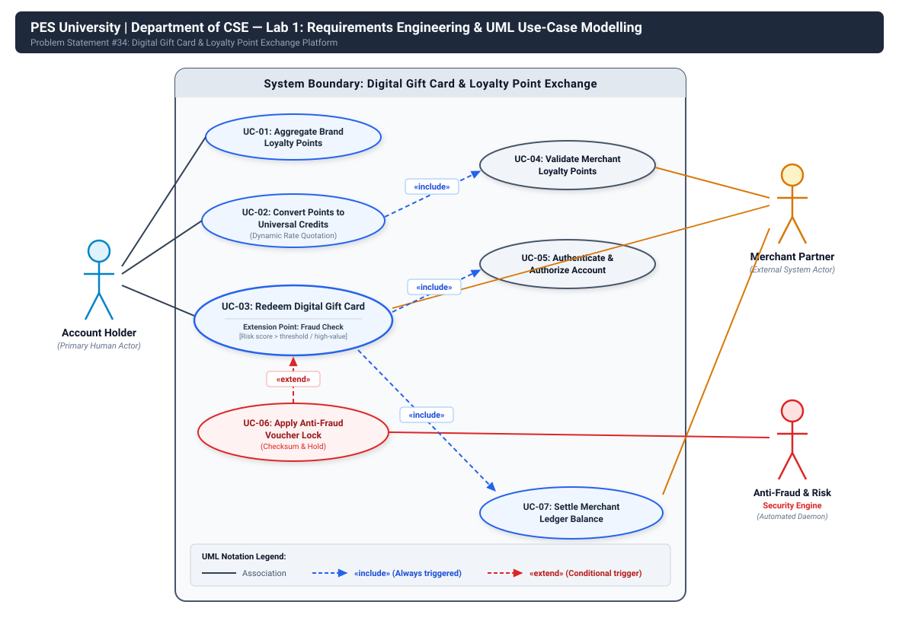

# Lab 1: Requirements Engineering & UML Use-Case Modelling
## PES University — Department of Computer Science & Engineering
### Course: Software Engineering / Systems Modelling Lab

---

## 📌 Problem Statement #34: Retail, E-Commerce & Finance
### **Digital Gift Card & Loyalty Point Exchange Platform**

### 1. Problem Context & Overview
In modern retail and e-commerce ecosystems, consumers accumulate loyalty points across fragmented brand programs that often expire unutilized. This project models a **Digital Wallet & Exchange Platform** that empowers users to:
1. **Aggregate** brand loyalty points from multiple merchant partners into a single wallet.
2. **Convert** loyalty points into universal exchange credits using real-time dynamic pricing algorithms.
3. **Redeem** digital gift cards across participating retail partners.
4. **Enforce anti-fraud voucher locking** using cryptographic checksums and automated risk scoring to eliminate voucher theft, bot scalping, and double-spending.

---

## 👥 Target Stakeholders & Actors

| Actor | Category | Description / Role |
| :--- | :--- | :--- |
| **Account Holder** | Primary Human Actor | End-user who owns the digital wallet, connects merchant loyalty programs, requests dynamic conversion quotes, and redeems digital gift cards. |
| **Merchant Partner** | External System Actor | Third-party retail/e-commerce partner whose API validates external loyalty point balances, provisions gift card vouchers, and receives financial ledger settlements. |
| **Anti-Fraud & Risk Engine** | Internal Automated System Actor | Real-time security subsystem that analyzes transaction velocity, IP/device reputation, enforces step-up MFA, and applies cryptographic voucher locking. |

---

## 📋 Complete Requirements Specification Table

| Req ID | Type | Description | Priority | Acceptance Criteria | Rationale |
| :--- | :--- | :--- | :--- | :--- | :--- |
| **FR-001** | Functional | The system shall validate merchant loyalty points, convert them into universal exchange tokens, and generate single-use digital voucher codes. | **High** | **Pass:** Voucher code generated with cryptographic checksum.<br>**Fail:** Expired or duplicate voucher redeemed. | Core point conversion and exchange mechanism enabling interoperability across multiple merchant loyalty programs. |
| **FR-002** | Functional | The system shall calculate real-time dynamic conversion rates between partner merchant loyalty points and universal exchange credits based on merchant liquidity, point expiry, and market demand. | **High** | **Pass:** System returns a conversion quote guaranteed for 120 seconds with transparent fee spread.<br>**Fail:** Quote generation times out (>2s) or uses stale rates (>5m old). | Guarantees transparent, market-driven valuation while protecting platform liquidity against arbitrage. |
| **FR-003** | Functional | The system shall allow an Account Holder to link multiple merchant loyalty accounts and aggregate real-time reward point balances into a unified digital wallet interface. | **Medium** | **Pass:** Successfully authenticates and synchronizes live point balances across at least 3 distinct merchant APIs.<br>**Fail:** Balance synchronization fails or leaks external auth credentials. | Consolidates fragmented reward point balances into a centralized dashboard for user convenience. |
| **FR-004** | Functional | The system shall enforce anti-fraud voucher locking by binding generated vouchers cryptographically to the Account Holder ID and requiring step-up MFA validation upon anomalous risk detection. | **High** | **Pass:** Voucher status transitions to 'Locked-Pending' and completes verification within 15 seconds.<br>**Fail:** Voucher redeemed simultaneously on multiple channels or before identity verification. | Mitigates gift card fraud, double-spending, account takeovers, and automated bot scraping. |
| **FR-005** | Functional | The system shall issue verifiable digital gift cards featuring tamper-evident QR codes/barcodes and execute double-entry ledger settlement with the issuing Merchant Partner. | **High** | **Pass:** Activated gift card rendered within 500 ms and partner ledger reflects corresponding debit/credit settlement entry.<br>**Fail:** Voucher issued with missing cryptographic hash or uncommitted ledger entry. | Completes end-to-end gift card redemption while maintaining auditable financial reconciliation with partner merchants. |
| **NFR-001** | Non-Functional *(Performance & Security)* | Point conversion and gift card redemption operations must process within 250 ms with zero ledger balance drift. | **High** | **Pass:** Benchmarking tests confirm target latency (<250 ms) and security standards under simulated peak load (1,000 TPS).<br>**Fail:** Operation latency exceeds 250 ms or ledger audit detects non-zero balance drift. | Critical for financial integrity, high-throughput consumer satisfaction, and maintaining zero accounting discrepancy across partner balances. |
| **NFR-002** | Non-Functional *(Security & Compliance)* | All sensitive credentials, voucher tokens, and transaction payloads must be encrypted in transit via TLS 1.3 and at rest via AES-256 with HSM-managed keys, adhering to PCI-DSS Level 1. | **High** | **Pass:** Vulnerability scan and static/dynamic cryptographic audit verify zero plaintext exposure of voucher keys in memory, logs, or storage.<br>**Fail:** Plaintext secret or weak cipher detected during audit. | Safeguards high-value exchange assets against unauthorized exfiltration and ensures strict compliance with financial regulations. |

---

## 📊 UML Use-Case Diagram



### UML Relationships Highlighted:
- **`«include»` Relationships:**
  - `UC-02: Convert Points to Universal Credits` **«include»** `UC-04: Validate Merchant Loyalty Points`: Converting points unconditionally requires validating point validity with the partner merchant.
  - `UC-03: Redeem Digital Gift Card` **«include»** `UC-05: Authenticate & Authorize Account`: Every redemption transaction must verify the user's active session and authorization.
  - `UC-03: Redeem Digital Gift Card` **«include»** `UC-07: Settle Merchant Ledger Balance`: Every gift card issuance triggers an atomic ledger entry with the partner.
- **`«extend»` Relationship:**
  - `UC-06: Apply Anti-Fraud Voucher Lock` **«extend»** `UC-03: Redeem Digital Gift Card`: Conditionally executed at **Extension Point: Fraud Check** only when the Anti-Fraud Engine flags an anomalous risk score (>=70) or high-value redemption.

---

## 📝 Use-Case Flow Specification: Core Use Case (UC-03)

### **UC-03: Redeem Digital Gift Card with Anti-Fraud Voucher Locking**

- **Actors:** Account Holder (Primary), Merchant Partner API (Secondary), Anti-Fraud & Risk Engine (Secondary).
- **Preconditions:**
  1. Account Holder is authenticated with an active session.
  2. Account Holder has sufficient universal exchange credits.
  3. Merchant Partner API is online and responding.
- **Postconditions:**
  1. Universal credits debited from Account Holder wallet.
  2. Single-use digital gift card with SHA-256 checksum generated and stored in wallet.
  3. Merchant settlement ledger updated.
  4. Immutable audit receipt logged.

### Step-by-Step Main Success Scenario:
1. Account Holder selects merchant gift card and denomination ($50).
2. System displays credit conversion cost and merchant redemption terms.
3. Account Holder confirms redemption order.
4. System verifies sufficient universal credit balance.
5. System transmits telemetry to Anti-Fraud & Risk Engine.
6. Anti-Fraud Engine computes low risk score (<30) and clears the transaction.
7. System places a transactional hold on required credits.
8. System sends issuance request to Merchant Partner API via TLS 1.3.
9. Merchant Partner API reserves inventory and returns raw voucher payload.
10. System generates cryptographic SHA-256 checksum, locks voucher to Account Holder ID, permanently debits credits, credits merchant ledger, and displays scannable QR/barcode.

### Alternate Flows:
- **Alternate Flow 4a (Insufficient Balance):** System alerts user of deficit and prompts point conversion via `UC-02`. Transaction terminates without debit.
- **Alternate Flow 6a (Anti-Fraud Voucher Lock Triggered):** Risk score >= 70 triggers `UC-06: Apply Anti-Fraud Voucher Lock`. Voucher marked `Locked-Pending Verification`. Step-up MFA requested; if valid within 60s, flow resumes at Step 7.
- **Alternate Flow 6b (MFA Failure / Expiry):** System terminates transaction, releases credit hold, locks issuance for 15 minutes, and notifies security team.

---

## 📂 Repository File Structure

```plaintext
Lab1_UML_Use_Case_Modelling/
│
├── README.md                          # Comprehensive project documentation
├── REQUIREMENTS_TABLE.md              # Requirements table (Markdown)
├── USE_CASE_FLOW_SPECIFICATION.md     # 1-page use case flow specification
│
├── use_case_diagram.svg               # High-resolution vector UML diagram
├── use_case_diagram.drawio            # Native Draw.io / Lucidchart editable model
│
├── requirements_table.pdf             # Formatted PDF export of requirements
├── use_case_diagram.pdf               # Formatted PDF export of UML diagram
└── use_case_flow_specification.pdf    # Formatted 1-page PDF of Use-Case Flow
```

---

## 🚀 Step-by-Step GitHub Upload Guide

Follow these commands to push this repository to your GitHub account:

### Step 1: Open Terminal in this Directory
```powershell
cd c:\school\ml\Lab1_UML_Use_Case_Modelling
```

### Step 2: Initialize Git Repository (if not already done)
```powershell
& "C:\Program Files\Microsoft Visual Studio8\Community\Common7\IDE\CommonExtensions\Microsoft\TeamFoundation\Team Explorer\Git\cmd\git.exe" init
& "C:\Program Files\Microsoft Visual Studio8\Community\Common7\IDE\CommonExtensions\Microsoft\TeamFoundation\Team Explorer\Git\cmd\git.exe" add .
& "C:\Program Files\Microsoft Visual Studio8\Community\Common7\IDE\CommonExtensions\Microsoft\TeamFoundation\Team Explorer\Git\cmd\git.exe" commit -m "feat: complete Lab 1 Requirements Engineering and UML Use-Case Modelling"
```

### Step 3: Create a New Repository on GitHub
1. Go to [https://github.com/new](https://github.com/new).
2. Repository name: `Lab1-UML-Requirements-Modelling` (or `Digital-Gift-Card-Exchange-UML`).
3. Choose **Public** or **Private**.
4. **Do NOT check** "Add a README file" (we already have a complete one).
5. Click **Create repository**.

### Step 4: Link and Push to GitHub
```powershell
# Set default branch to main
& "C:\Program Files\Microsoft Visual Studio8\Community\Common7\IDE\CommonExtensions\Microsoft\TeamFoundation\Team Explorer\Git\cmd\git.exe" branch -M main

# Add your GitHub remote URL (replace YOUR_USERNAME with your GitHub handle)
& "C:\Program Files\Microsoft Visual Studio8\Community\Common7\IDE\CommonExtensions\Microsoft\TeamFoundation\Team Explorer\Git\cmd\git.exe" remote add origin https://github.com/YOUR_USERNAME/Lab1-UML-Requirements-Modelling.git

# Push your code
& "C:\Program Files\Microsoft Visual Studio8\Community\Common7\IDE\CommonExtensions\Microsoft\TeamFoundation\Team Explorer\Git\cmd\git.exe" push -u origin main
```

---
**PES University — Department of Computer Science & Engineering**
